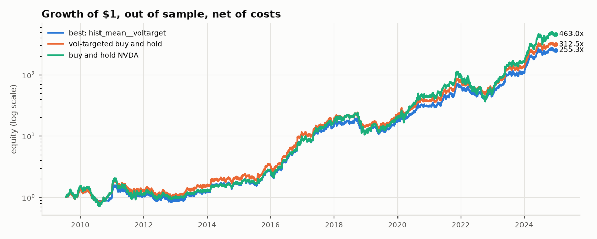
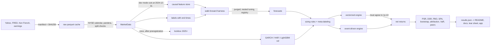

# Can a model beat holding NVDA? An out-of-sample test

This repo started as a tutorial Keras LSTM that "predicted" NVDA's next opening price. Version 2 asks a harder question with the controls a quant researcher would expect: can any model, from a ridge regression to a small Transformer, forecast NVDA's next-day return well enough to beat simply holding the stock, after costs, out of sample, and after accounting for how many things I tried?

On the development period, the answer is no. The best of every configuration I tested is a naive baseline that stays long and scales its position by forecast volatility, and no machine-learning forecast beats vol-targeted buy and hold. The lockbox (2025 onward), preregistered and evaluated once, doesn't overturn that: every configuration's Sharpe is well inside the uncertainty around vol-targeted buy and hold. The numbers below are generated from `reports/results.json` by `make report`.

## Results

<!-- RESULTS:START -->
Out-of-sample decisions from 2009-07-22 to 2024-12-31 (3884 sessions), after costs, next-open execution. 80 strategy configurations were backtested, and all of them count as trials in the Deflated Sharpe Ratio.

| Strategy | Net Sharpe [95% CI] | CAGR | Vol | Max DD | Turnover/yr | DSR |
|---|---|---|---|---|---|---|
| `hist_mean` + voltarget | 1.18 [0.68, 1.64] | 43.3% | 36.0% | -46.8% | 4.4 | 0.99 |
| `ridge` + voltarget | 1.00 [0.51, 1.49] | 33.0% | 34.5% | -61.3% | 22.8 | 0.94 |
| `lgbm` + voltarget | 1.14 [0.64, 1.61] | 39.3% | 34.1% | -53.2% | 18.0 | 0.98 |
| `lstm_gauss` + voltarget | 0.83 [0.38, 1.33] | 22.2% | 29.1% | -56.4% | 26.4 | 0.80 |
| `gru_quant` + kelly | 0.95 [0.45, 1.40] | 38.3% | 44.6% | -62.8% | 51.3 | 0.91 |
| `tcn` + voltarget | 0.84 [0.38, 1.31] | 22.5% | 29.0% | -55.3% | 46.5 | 0.82 |
| `patchtst` + voltarget | 1.01 [0.52, 1.47] | 28.0% | 28.5% | -36.1% | 36.4 | 0.94 |
| `ens_equal` + voltarget | 0.92 [0.46, 1.42] | 26.7% | 31.0% | -41.2% | 28.8 | 0.88 |
| `ens_stack` + voltarget | 1.03 [0.54, 1.49] | 33.1% | 33.0% | -45.8% | 18.0 | 0.95 |
| `meta` + voltarget | 0.45 [-0.05, 0.93] | 4.0% | 9.8% | -31.5% | 12.6 | 0.25 |
| Vol-targeted buy and hold | 1.21 [0.69, 1.67] | 45.2% | 36.3% | -46.8% | 4.3 | 0.99 |
| Buy and hold NVDA | 1.10 [0.61, 1.57] | 48.9% | 46.0% | -67.2% | 0.1 | 0.97 |
| Buy and hold SMH | 0.89 [0.43, 1.39] | 22.7% | 27.2% | -46.9% | 0.1 | 0.85 |
| Buy and hold QQQ | 0.98 [0.50, 1.50] | 19.4% | 20.1% | -36.7% | 0.1 | 0.92 |
| 200-day trend rule | 1.24 [0.77, 1.71] | 48.5% | 37.4% | -53.3% | 3.8 | 0.99 |

- Best development strategy: `hist_mean` + voltarget. Its Sharpe minus the vol-targeted buy and hold's is -0.03. DSR 0.99 (with every logged fit counted as a trial: 0.95). The DSR asks whether a Sharpe beats what luck across the trials would produce; it doesn't compare against a benchmark, and vol-targeted buy and hold scores 0.99 on the same test.
- Probability of backtest overfitting (CSCV): 0.29. Hansen SPA p-value against vol-targeted buy and hold: 0.15 on raw returns and 0.99 with every strategy scaled to the benchmark's volatility; against buy and hold: 0.27.
- Random long/flat timing with the same exposure and switching rate, sized with the same vol target and costs, beats it 78.4% of the time.
- Fama-French 5 + momentum alpha (monthly): 24.1% a year (t = 2.41), against 25.3% (t = 2.49) for vol-targeted buy and hold, so the alpha is NVDA's, not the model's. 2023 and 2024 account for 83% of its compounded dollar gain (29% of its summed daily returns).

| Forecast model | IC | IC t (NW) | R2 OOS vs zero | DM stat vs zero (negative = better) | DM p | Hit rate |
|---|---|---|---|---|---|---|
| `ar` | 0.056 | 3.35 | 0.49% | -1.77 | 0.077 | 52.9% |
| `elastic_net` | 0.036 | 2.24 | 0.21% | -1.39 | 0.163 | 52.9% |
| `ens_equal` | 0.010 | 0.60 | 0.17% | -0.52 | 0.601 | 50.9% |
| `ens_stack` | 0.000 | 0.00 | -0.18% | 0.62 | 0.534 | 52.1% |
| `gru_gauss` | -0.008 | -0.48 | -0.96% | 1.88 | 0.060 | 50.0% |
| `gru_quant` | 0.016 | 0.91 | -1.45% | 2.12 | 0.034 | 50.1% |
| `hist_mean` | 0.035 | 2.27 | 0.23% | -1.53 | 0.126 | 52.8% |
| `lgbm` | 0.021 | 1.29 | 0.12% | -0.63 | 0.528 | 53.1% |
| `lstm_gauss` | 0.021 | 1.25 | -0.10% | 0.22 | 0.828 | 51.1% |
| `lstm_quant` | 0.031 | 1.80 | -0.22% | 0.41 | 0.684 | 51.6% |
| `patchtst` | -0.000 | -0.00 | -2.01% | 3.55 | 0.000 | 50.7% |
| `ridge` | 0.033 | 1.99 | 0.42% | -1.84 | 0.066 | 52.1% |
| `tcn` | -0.014 | -0.86 | -1.21% | 2.19 | 0.029 | 49.8% |

v1 replica (the original stacked ReLU LSTM on price levels, refit yearly): median absolute error 0.75 vs 0.02 for persistence; worse than persistence on 92% of days; on 10.6% of days its forecast exceeded 10x the training range (ReLU blow-up once prices left the MinMax range). Direction accuracy 49.1% vs 52.9% up days. Details: [docs/V1_POSTMORTEM.md](docs/V1_POSTMORTEM.md).

**Lockbox** (2025-01-02 to 2026-09-21, 430 sessions, evaluated once):

| Strategy | Net Sharpe [95% CI] | Total return | Max DD |
|---|---|---|---|
| `hist_mean` + voltarget | 0.82 [-0.56, 2.27] | 46.9% | -30.6% |
| `lgbm` + voltarget | 0.85 [-0.60, 2.22] | 46.9% | -27.0% |
| `ridge` + voltarget | 0.98 [-0.43, 2.49] | 60.5% | -24.1% |
| Buy and hold NVDA | 0.82 [-0.43, 2.14] | 59.5% | -42.8% |
| Vol-targeted buy and hold | 0.82 [-0.56, 2.27] | 46.9% | -30.6% |
| Buy and hold SMH | 1.46 [0.12, 2.83] | 136.2% | -35.1% |
| Buy and hold QQQ | 1.04 [-0.28, 2.45] | 42.9% | -24.2% |
| 200-day trend rule | 0.42 [-1.06, 2.00] | 15.4% | -35.2% |

2025 stress window `deepseek_2025` (2025-01-24 to 2025-02-07, dated by holding period): `hist_mean` + voltarget -11.9%, `lgbm` + voltarget -14.7%, `ridge` + voltarget -11.1%, Buy and hold NVDA -12.3%, Vol-targeted buy and hold -11.9%, 200-day trend rule -24.3%, Buy and hold SMH -7.6%, Buy and hold QQQ -1.1%.

2025 stress window `tariff_2025` (2025-04-02 to 2025-04-21, dated by holding period): `hist_mean` + voltarget -3.7%, `lgbm` + voltarget 6.4%, `ridge` + voltarget -1.4%, Buy and hold NVDA -7.9%, Vol-targeted buy and hold -3.7%, 200-day trend rule 0.0%, Buy and hold SMH -8.9%, Buy and hold QQQ -5.9%.

<sub>Generated by `make report` from `reports/results.json` (git f304b5d, data e2fdd3b2b961, config ba8c37786f54).</sub>
<!-- RESULTS:END -->



The full generated tables are in [docs/RESULTS.md](docs/RESULTS.md), and the tear sheet is [reports/tearsheet.html](reports/tearsheet.html).

## What didn't work

<!-- WHAT_DIDNT_WORK:START -->
- **Machine learning didn't beat vol targeting.** The best strategy built on an ML forecast is `lgbm` + voltarget at a net Sharpe of 1.14, against 1.21 for vol-targeted buy and hold. Across all 80 configurations, Hansen's SPA p-value against that benchmark is 0.15.
- **Forecasts are weak.** 1 of 11 ML and ensemble forecasts have a Newey-West IC t-stat above 2 (`elastic_net`), and none of them turns that into a better strategy than the benchmark after costs.
- **Deep models were the worst forecasters.** Their out-of-sample R2 against the zero forecast ranges from -2.01% to -0.10%. The model confidence set at 10% drops `patchtst`, `tcn`, `gru_gauss`, `gru_quant`.
- **The regime filter hurt.** Going flat in the filtered high-vol regime lowered the Sharpe for 13 of 13 vol-targeted strategies.
- **Meta-labeling on the 200-day trend rule** reached a net Sharpe of 0.45 (vol-targeted), against 1.24 for the trend rule alone.
- **No edge on the peers either.** With the same pipeline and the voltarget sizing, the strategy beat that peer's vol-targeted buy and hold for `ridge` on 1 of 10, `lgbm` on 0 of 10, `hist_mean` on 0 of 10.
- **The v1 model doesn't survive walk-forward.** It was worse than persistence on 92% of days.
<!-- WHAT_DIDNT_WORK:END -->

## How it works



- **Timing.** Every decision is made after the close of day t and filled at the open of t+1. The label, the forecast target, and the PnL are all the same open-to-open return. Anything that isn't NVDA's own price is lagged one more day.
- **No lookahead, tested.** Every feature is a registered pure function. A hypothesis property test perturbs all data after a random cutoff and checks that nothing at or before the cutoff changes. It also covers the fracdiff and HMM features, which are fit walk-forward, and the HMM uses my own forward filter rather than the smoothed posteriors.
- **Validation.** Expanding walk-forward, where training labels must resolve before the test block. Tuning happens inside each training window on purged k-fold with an embargo. CPCV is a secondary check.
- **Models.** Zero, historical mean, and AR baselines; ridge, elastic net, LightGBM; LSTM and GRU (Gaussian and quantile heads), TCN, and a small PatchTST-style encoder; equal-weight and stacked ensembles; meta-labeling on a trend rule; six volatility models.
- **Costs.** Spread, commission, vol-scaled slippage, square-root market impact at $10M, and borrow on shorts, plus a 0 to 20 bps sensitivity sweep.
- **Statistics.** Bootstrap CIs, PSR, the Deflated Sharpe Ratio with the registry's trial count, PBO via CSCV, Hansen's SPA and White's Reality Check, attribution with Newey-West errors, VaR backtests, and the same pipeline run on ten peers to check for selection bias.

The full math is in [docs/METHODOLOGY.md](docs/METHODOLOGY.md), the design decisions are in [docs/adr/](docs/adr/), and the rules I work to are in [docs/CONVENTIONS.md](docs/CONVENTIONS.md).

## From v1 to v2

v1 claimed "an RMSE of 0.08" and "strong trend accuracy". [docs/V1_AUDIT.md](docs/V1_AUDIT.md) goes through what was actually there. The download script couldn't be parsed (UTF-16), the test runner found zero tests, and the saved notebook run was trained on a newest-first CSV, so the model learned to predict the past from the future. No cell in the notebook computes the RMSE the README quoted.

v2 re-runs the same architecture honestly (a PyTorch replica of the four-layer ReLU LSTM, walk-forward, compared with persistence). That write-up is in [docs/V1_POSTMORTEM.md](docs/V1_POSTMORTEM.md). The short version: once prices move above the training range, MinMax-scaled inputs go above 1 and the ReLU recurrences blow up.

## Reproduce

```bash
git clone https://github.com/adamissac/nvidia-stock-rnn-forecasting && cd nvidia-stock-rnn-forecasting
make setup                # uv sync (Python 3.12), LightGBM libomp fix on macOS, pre-commit
make reproduce            # data -> data-report -> features -> train -> backtest -> evaluate -> report
make ci                   # lint, types, tests, and the synthetic end-to-end run (no network)
make app                  # Streamlit viewer over reports/
```

The full pipeline takes well under the 3-hour budget on a CPU laptop. The wall time of every fit is in `reports/registry/trials.jsonl`. `PROFILE=fast` runs everything on synthetic data in under a minute. Downloads are cached, and `data/raw/manifest.json` records the SHA256 of every file. Every artifact is tagged with the git SHA, config hash, and data hash.

The lockbox (2025-01-01 onward) is evaluated exactly once, after [docs/PREREGISTRATION.md](docs/PREREGISTRATION.md) is committed, by `make lockbox`. A second run is refused.

## Limitations

- One stock, daily bars. NVDA was picked with hindsight, and its drift during the sample is extreme. The peer study checks this, but the universe is also today's list of large semiconductor names, so it has survivorship bias.
- Yahoo's adjusted prices and earnings dates aren't point-in-time. The caveats and mitigations are in the methodology.
- The cost model is a parametric approximation. It isn't calibrated to real fills.
- The 2008 crisis falls before the first out-of-sample date, so it's reported for benchmarks only.
- A null result on these features and models doesn't show that NVDA is unpredictable. It shows these models, on this data, don't beat vol targeting after costs.

## Repo map

`src/nvquant/` (package) · `configs/` (YAML) · `tests/` (unit, property, integration) · `tools/` (leakage lint) · `reports/` (generated) · `docs/` · `app/` (Streamlit) · `legacy/` (v1, untouched)

## Disclaimer

This is a research and learning project. Nothing here is investment advice, and past backtest results, even out of sample, don't predict future returns.

## License and citation

MIT. See [LICENSE](LICENSE) and [CITATION.cff](CITATION.cff).
